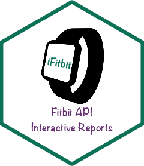
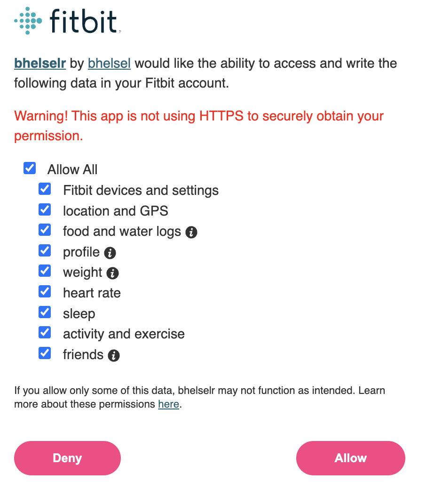

# iFitbit  
 
<!-- badges: start -->
[](https://CRAN.R-project.org/package=iFitbit)
[](https://github.com/bhelsel/iFitbit/actions/workflows/R-CMD-check.yaml)
<!-- badges: end -->

## Getting Started

To get started with the `iFitbit` package, you need to set up an application
that can access the Fitbit API. You can do this by following the instructions on
Fitbit's <a
href="https://dev.fitbit.com/build/reference/web-api/developer-guide/getting-started/">
Getting Started</a> page or in this [Vignette]("fitbit-application.html"). Once
you have the application set up with your Fitbit key and secret, you are ready
to authorize your app!

## Install the `iFitbit` package

```r
# Install the devtools package if it is not already installed
install.packages("devtools")

# Use the `install_github` function to download iFitbit from GitHub
devtools::install_github("bhelsel/iFibit")
```

## Authorizing your Fitbit app

Authorizing your Fitbit app is a simple process with the `iFitbit` R package. We
have a function called `authorize_fitbit_app` that takes the arguments
`directory`, `appname`, `key`, `secret`, and `redirect_uri`. The `directory`
argument is your project folder and where the Fitbit access token will be saved.
The `appname`, `key`, `secret`, and `redirect_uri` arguments are from creating
the Fitbit application. You will also need the `key` and `secret` arguments for
refreshing your access tokens.

We can authorize the Fitbit application by loading `iFitbit` and calling the
`authorize_fitbit_app` function.

```r
library(iFitbit)

authorize_fitbit_app(
  directory = "/Full/path/to/directory", 
  appname = "myapp", 
  key = Sys.getenv("FITBIT_KEY"), 
  secret = Sys.getenv("FITBIT_SECRET"), 
  redirect_uri = httr::oauth_callback()
)
```

Once you call the `authorize_fitbit_app` function, your browser will open to a
Fitbit login screen (unless you are already logged into Fitbit). After entering
the study participant's Fitbit username and password, you will be prompted to
allow the application access to different types of Fitbit data. If you are
interested in all types of data, you can select the "Allow All" option. Click
"Allow" once you are satisfied with your selection. 

<center></center>

The `authorize_fitbit_app` function will save a .Rdata file to your directory
under a tokens folder containing the access token. It will also create an empty
SQL database stored in a data that will be used to store the activity, device,
heart rate, sleep, and other data extracted from the Fitbit API. The default
name of the token and database files are the Fitbit username. The easiest way to
identify the Fitbit username is to navigate to the participant's profile and
look at the last 6 characters of the URL. If needed, you can change the
participant's username but this must be done through this Fitbit app and can
only be changed once every 60 days. Now that you have authorized your app, we can
explore a few of the `iFitbit` functions.

## Refreshing your Fitbit app

Access tokens are only valid for 8 hours, so it is important to run the
`refresh_fitbit_token` function before making a call to the Fitbit API. The
`refresh_fitbit_token` takes the token path name, Fitbit key, and Fitbit secret
as arguments. You also have the option to force a refresh of the Fitbit access
token even if the token has not expired. The `refresh_fitbit_token` is set up to
refresh the token if the token is within 1 hour of it's expiration time. This
will save the access token to the tokens folder overwriting the previous access
token.

```r
refresh_fitbit_token(
  token.pathname = "/Full/path/to/access/token",
  key = Sys.getenv("FITBIT_KEY"), 
  secret = Sys.getenv("FITBIT_SECRET"),
  force.refresh = FALSE
)
```

## Extracting Exercise from the Fitbit API

Now that the access token has been refreshed, accessing the Fitbit API is as
easy as calling the function that you are interested in for a specific data
category (called resources by Fitbit and `iFitbit`). For example, you would
write the following code to extract today's activity calories, calories, distance,
elevation, floors, steps, and minutes of sedentary time, light activity, fairly
active activity, and very active activity for a participant.

```r
get_fitbit_activities(
  token.pathname = "/Full/path/to/access/token"
  resource.options = "All Resources"
)
```

You could also specify a date range or only specific resources.

```r
get_fitbit_activities(
  token.pathname = "/Full/path/to/access/token",
  resource = c("minutesFairlyActive", "minutesVeryActive"),
  start.date = "2022-11-01",
  end.date = "2022-11-30"
)
```

You can also get the participant's exercise log with the `get_fitbit_exercise_log`
function. In addition to the `token.pathname` argument, this function also takes
a `limit` argument to indicate how many of the previous exercise sessions you
want to extract from the Fitbit API. Currently, the default behavior of this
function is to extract the most recent 25 exercise sessions and to remove any
exercise session that was less than 1 minute in length to filter out the
accidental starting of a participant's watch. 

```r
get_fitbit_exercise_log(
  token.pathname = "/Full/path/to/access/token",
  limit = 25
)
```
## Additional Functions in `iFitbit`

There are other functions in `iFitbit` that can be used to extract profile,
device, sleep, and intraday heart rate information. These functions will expand
as the package develops over time. The current list of functions includes:

* `get_fitbit_profile` for <a href="https://dev.fitbit.com/build/reference/web-api/user/get-profile/">User Information</a>.
* `get_fitbit_device` for <a href="https://dev.fitbit.com/build/reference/web-api/devices/get-devices/">Device Information</a>.
* `get_fitbit_sleep` for <a href="https://dev.fitbit.com/build/reference/web-api/sleep/get-sleep-log-by-date-range/">Sleep Data</a>.
* `get_fitbit_heart_intraday` for <a href="https://dev.fitbit.com/build/reference/web-api/intraday/get-heartrate-intraday-by-date/">Intraday Heart Rate Data</a>.

## Interactive Reports

Another important part of health interventions is the education provided by a
health educator who works with the participant on goal setting, addressing
barriers, finding motivators, and other important aspects of behavior change.
While a single report won't fit all situations, R has some great packages for
interactive tables and figures that can be used to guide health educator meetings
with study participants. One of the primary purposes of this package is to
assemble the data extracted from the Fitbit API into a usable form for the
research team members who are meeting with the participants in a research study.
We use the `get_fitbit_report` function to generate an HTML report with
interactive tables from the `reactable` R package and interactive plots from
`ggplot2` and `plotly` packages. To render the reports, simply call
`get_fitbit_report` using the `directory` and `id` arguments. This
function reads in data from the SQL databases stored in the data folder,
renders a Rmarkdown HTML document with the interactive tables and figures, and
saves it into a reports folder in the directory.

```r

# Example Fitbit database included in the iFitbit package
database_pathname <- system.file(package = "iFitbit"), "extdata/9BLPHQ.db")
# Set to current directory or change the location before running report
reports_pathname <- getwd()

get_fitbit_report(
  database_pathname = database_pathname,
  reports_pathname = reports_pathname,
  toHTML = TRUE, returnData = FALSE, toCSV = FALSE,
  study_name = "study", report_author = "iFitbit",
  reportName = "FitbitReport"
)
```
The `get_fitbit_report` also allows you to return the data set to R Studio or
write the data to a CSV file by changing the argument `returnData` or `toCSV` to 
TRUE. There is a small amount of customizaiton that can happen with the report
if you want to change the study name or author. Finally, only a single report
exists right now (i.e., FitbitReport), but the idea behind this package is to
create additional templates that can be used for different scenarios. Hopefully
the number of templates and diversity of data extracted from the Fitbit API
can be expanded over time.


