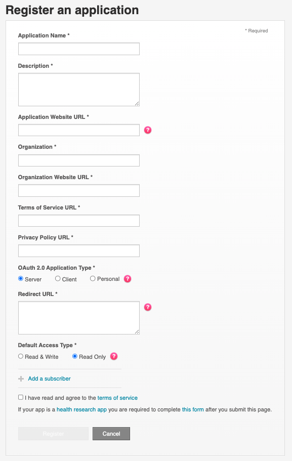
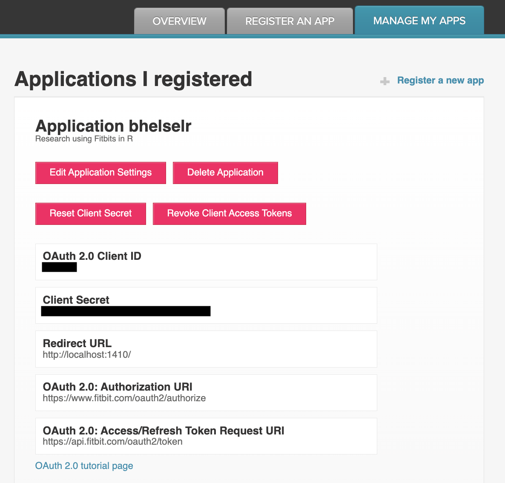

```{css, echo = FALSE}

p {
  font-size: 16px;
}

code {
  background-color: rgba(0, 0, 0, 0.07) !important;
}

```

## Getting Started

<p> 
Fitbit has a useful guide to get started with the Fitbit APIs. This vignette is
to help get you started with the `iFitbit` R package, but you will need to
create a Fitbit developer account first. Here is a link to Fitbit's <a href =
"https://dev.fitbit.com/build/reference/web-api/developer-guide/getting-started/">
Getting Started</a> page. To use the Fitbit APIs, you need to have a developer
account.
</p>

<p>
To create a Fitbit developer account, you must first register for a user account
at <a href="https:://accounts.fitbit.com/signup">fitbit.com</a>. This requires
the verification of a valid email address. Once the email address is verified,
the user will be able to log into the <a
href="https://dev.fitbit.com/apps">developer</a> page to register new
applications that query the Web APIs.
</p>

## Register an Application
<p>
After you create a developer account, the next step is to register an
application. You can do this under <a
href="https://dev.fitbit.com/apps/new">Register an App</a> in the Fitbit
Developer page. You will need to add the application name, a description of the
app, an application website URL, organization, an organization website URL,
terms of service URL, privacy policy URL, and a redirect URL. You will also need
to indicate your OAuth 2.0 Application Type and the Default Access Type (i.e.,
read only or read & write). </p>

<center></center>

## Managing the Application
<p>
Following the registration of your new Fitbit application, you can access the
application information under the <b>Manage My Apps</b> page. You will see the
name of your application under <i>Applications I Registered</i>. Click on the
name of your application to open the details of your application. You will need
to extract the <b>Client ID</b> and the <b>Client Secret</b>. `iFitbit` assumes
that your Redirect URL is <u>http://localhost:1410/</u>, so you don't need to
extract the Redirect URL unless it is different from this standard.
</p>

<center></center>

## Storing the Client ID and Secret

<p>
Storing the Client ID and Secret will be essential for accessing the Fitbit API.
You may choose to store it on your computer in a secure folder, but R can also
store the Fitbit Client ID and Secret for you using the `Sys.setenv()` function
in R. For example, to set the Fitbit Client ID, you could write
`Sys.setenv(FITBIT_KEY = "X")` replacing "X" with your OAuth 2.0 Client ID.
Similarly, you could store your secret by typing `Sys.setenv(FITBIT_SECRET =
"Y")` and replacing "Y" with your Client Secret. You can check to see if they
stored in your R environment with `Sys.getenv()` and looking for "FITBIT_KEY"
and "FITBIT_SECRET".
</p>

## Final Steps

<p>
You can access the Fitbit Key and Secret directly from your R session by writing
`Sys.getenv("FITBIT_KEY")` and `Sys.getenv("FITBIT_SECRET")`. This is one way of
including them in the `authorize_fitbit_app` and `refresh_fitbit_token`
functions within the `iFitbit` R package when needing to authorize the
application and retrieve the access and refresh tokens. Finally, if you intend to
use your Fitbit application for a research study it is important to follow Fitbit's
guidelines for submitting research applications. Here are some <a
href="https://healthsolutions.fitbit.com/researchers/faqs/">frequently asked
questions</a> that include information about using the public web API and
submitting a research application. If you are interested in <i>intraday</i> data,
then you will also want to submit a request for intraday data which can extend the
detail-level to include 1-minute and 15-minute for the activities and 1-second
and 1-minute for heart rate. `iFitbit` has functions that can extract the intraday
data with approval.
</p>


